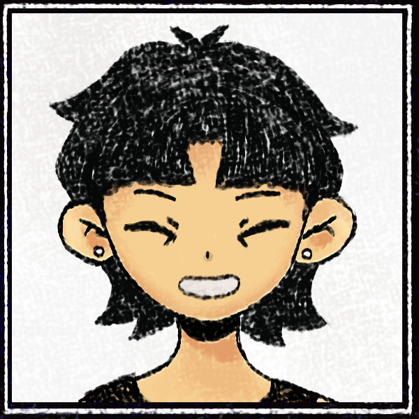

<!-- SOUL / HP bar fake, estilo status do Undertale -->

 
<!-- Sprite do Personagem estilo Pixel Art -->

  
<!-- Caixa de Texto Estilo Undertale (Fonte VT323 / Pixel Art) -->

  
<!-- Botões de ação -->

&nbsp;

  
<!-- Texto narrativo estilo Undertale, mesma fonte (VT323), digita uma vez e fica parado -->

