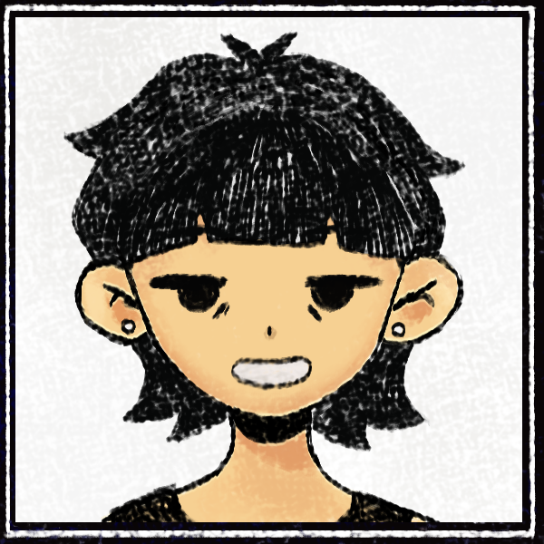

<!-- SOUL / HP bar fake, estilo status do Undertale -->

 
<!-- Sprite do Personagem estilo Pixel Art -->

  
<!-- Caixa de Texto Estilo Undertale (Fonte VT323 / Pixel Art) -->

  
<!-- Botão único de acesso ao portfólio -->

  
<!-- Texto narrativo estilo Undertale -->
* (Você encontra um portfólio muito interessante)
 
* (Isso te enche de determinação.)

